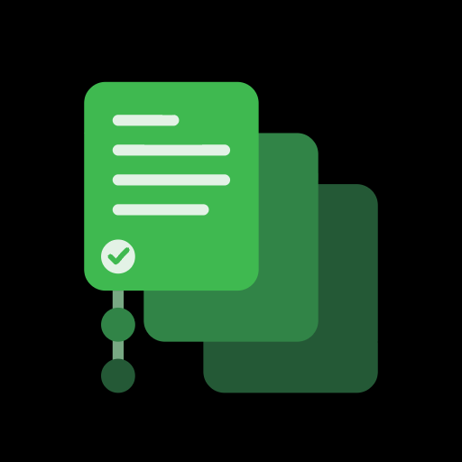

# CommitBook



Automated git commits and sync for your markdown CommitBooks. Turn any git repository into a self-saving, self-syncing note-taking workspace.

## What It Does

CommitBook runs in the background and periodically:
1. **Commits** a local snapshot when Git reports non-ignored changes (works offline)
2. **Syncs** with the remote using Git three-way merge (when online)

Commit messages use a timestamp by default, or an AI CLI (GitHub Copilot, Claude Code, Codex, Gemini, Cursor) when you opt in. Local changes are committed before network sync begins.

## Quick Start

```bash
# Install
curl -fsSL https://raw.githubusercontent.com/CommitBook/CommitBook-Core/main/install.sh | bash

# Navigate to your notes repo
cd ~/my-notes

# Initialize CommitBook (once per repo)
commitbook init

# Run your first sync
commitbook sync

# Start scheduled syncs (the scheduler runs `commitbook sync`)
commitbook schedule 1h
commitbook start
```

## Use Cases

| Guide | Description |
|---|---|
| [AI Agent Dotfiles](use-cases/DotFiles-with-AI-Agents.md) | Auto-sync config for Claude, Cursor, Codex, Copilot and other AI agents |

## Short command

`cobo` is installed alongside `commitbook` and accepts the same commands, for
example `cobo sync` or `cobo status`. Schedulers always invoke `commitbook sync`;
keep both executables installed together. Generate completions with
`cobo completions <shell>` for the short name.

## Commands

| Command | Description |
|---|---|
| `commitbook init [--yes]` | Initialize `.CommitBook/` (required before any other command); asks before committing and pushing the metadata, `--yes` skips the question |
| `commitbook sync` | Commit locally, fetch/merge, then push (the scheduler runs this same command) |
| `commitbook start` | Start the sync scheduler (launchd/cron) |
| `commitbook stop` | Stop the sync scheduler |
| `commitbook status` | Show current sync state, schedule, devices, and config |
| `commitbook devices` | List the devices syncing this CommitBook; `rename <name>` renames this one, `remove <id>` removes another |
| `commitbook preview` | List files the next local snapshot would include |
| `commitbook schedule <expr>` | Change the sync schedule |
| `commitbook doctor` | Check system health and dependencies |
| `commitbook log` | View recent activity log |
| `commitbook completions <shell>` | Generate shell completion scripts |

### Schedule Presets

```bash
commitbook schedule 1h             # Every hour (default)
commitbook schedule 30m            # Every 30 minutes
commitbook schedule 4h             # Every 4 hours
commitbook schedule daily          # Daily at 9:00 AM
commitbook schedule "30 * * * *"   # Custom cron expression
```

Presets are stored as written (`1h`, `15m`, `daily`); aliases such as `hourly`
or `every-30m` and equivalent cron expressions are stored in that short form.
Minute intervals must divide evenly into 60 and hour intervals must divide
evenly into 24. This keeps `every N` schedules uniform across clock-field
boundaries. On macOS, unsupported calendar-shaped cron expressions are rejected
instead of being silently converted to an hourly launchd job.

## How It Works

```
commitbook sync
       |
       v
  1. LOCAL SNAPSHOT (when Git reports changes; no network required)
     - Detect tracked and non-ignored working-tree/index changes
     - Stage all changes using normal Git semantics
     - Generate commit message ([commit] mode and agent)
     - git commit
       |
       v
  2. SYNC (only if remote reachable)
     - Fetch the configured remote branch
     - Fast-forward or run a libgit2 three-way merge
     - Handle conflicts per [conflicts] mode (both, manual, ai, review)
     - Push the result, retrying once if the remote moved
     - Update state.toml
       |
       v
  3. On failure:
     - Local commit is preserved
     - Error logged to .CommitBook/local/logs/
     - Retry on next scheduled cycle
```

### Offline Mode

If the remote is unreachable, CommitBook still commits local edits. Each scheduled cycle creates a new snapshot only when Git reports a real change. When connectivity returns, the next sync merges and pushes the accumulated commits.

### Git Three-Way Merge

CommitBook uses libgit2's normal merge analysis and file-level three-way merge:

- **Up to date**: no merge is needed.
- **Behind only**: fast-forward to the remote commit without rewriting history.
- **Diverged**: create a normal two-parent merge commit.
- **Conflicted**: handled by `[conflicts] mode`, see [Merge conflicts](#merge-conflicts).

Local changes are committed before fetching, so a network or merge failure does not discard the user's writing. A later sync resumes an unfinished manual merge after the conflicted files have been resolved and staged.

Sync never touches a git operation you started yourself. While a merge of
another branch, a cherry-pick, revert, rebase, `am`, or bisect is in progress,
or while the index still holds conflicts (for example from `git stash pop`),
sync stops with an error and changes nothing. Finish or abort that operation,
then sync again.

Desktop conflict resolution invokes the configured AI CLI. Mobile resolution
uses an asynchronous callback implemented by the embedding Swift/Kotlin app;
the app calls its AI provider or backend over HTTPS from the phone. The mobile
engine never contacts a CommitBook desktop app.

## AI Commit Messages

By default, automatic commits use local timestamp text: `Writing 2026-04-07 14:30:02`.
No AI CLI is invoked for commit messages or agent status checks in this mode.

To opt in, pick **Commit messages → ai** on the web Config page, or edit
`.CommitBook/config.toml`:

```toml
[commit]
mode = "ai"      # timestamp (default) | ai
agent = "claude" # any | claude | codex | copilot | gemini | cursor
```

With a single agent, sync asks only that CLI. With `any`, it tries every
installed agent in the order below. If the agent is missing or fails, the
local timestamp message is used. Mobile sync always uses timestamp messages.

| Order for `any` | Agent | Invocation |
|---|---|---|
| 1 | GitHub Copilot CLI | `gh copilot -- -p "<prompt>" --silent --no-color --no-custom-instructions` |
| 2 | Claude Code CLI | `claude -p "<prompt>"` |
| 3 | Codex CLI | `codex exec --ephemeral --sandbox read-only --color never --output-last-message <file> -` |
| 4 | Gemini CLI | `gemini -p "<instruction>"` with the prompt on stdin |
| 5 | Cursor Agent | `cursor-agent -p --output-format text` with the prompt on stdin |

Run `commitbook doctor` to see which configured agents are installed.

## Configuration

### `.CommitBook/` Directory

CommitBook stores all state inside `.CommitBook/` in the repository root. No global config or database.

```
.CommitBook/
  .gitignore        # Contains /local/ (committed to git)
  config.toml       # Settings (committed to git)
  devices/          # One file per device (committed to git)
    7f3c9a2e.toml
  local/            # Local state and secrets (gitignored)
    device-id       # This device's id
    auth.toml       # Optional token-backed credentials
    state.toml      # Sync state
    preferences.toml # Per-device preferences (mobile)
    logs/           # Activity logs
    .lock           # Prevents overlapping repository mutations
```

`commitbook init` creates this directory and commits its metadata. The nested
`.CommitBook/.gitignore` excludes `/local/`; the repository-root `.gitignore`
is left untouched.

### `config.toml` (committed)

`commitbook init` writes this file with the comments shown. Later saves edit
values in place, so your own comments survive. Invalid values and unknown keys
are rejected with the allowed values. A file in an older format asks you to
delete it and run `commitbook init` again.

```toml
# CommitBook settings. This file is committed and shared by every device.

[config]
schema = 1                    # file format, managed by CommitBook; do not edit

[commitbook]
name = "notes"                # display name

[git]
branch = "main"
remote = "origin"             # provider, owner and repo are read from this remote's URL

[sync]
schedule = "1h"               # 5m | 15m | 30m | 1h | 2h | 4h | daily | 5-field cron expression

[commit]
mode = "timestamp"            # timestamp: "Writing <time>" message | ai: ask the agent
agent = "any"                 # any | claude | codex | copilot | gemini | cursor
                              # any = first installed of copilot, claude, codex, gemini, cursor

[conflicts]
mode = "both"                 # both: keep both versions without markers, you delete one
                              #   (.md, .markdown, .txt; other files fall back to manual)
                              # manual: leave <<<<<<< markers, sync stops until resolved
                              # ai: agent resolves | review: agent proposes, you approve
agent = "claude"              # claude | codex | copilot | gemini | cursor (used by ai and review)

[logs]
keep = "30d"                  # <N>d (e.g. 7d, 30d, 90d) | forever
```

The web Config page edits every setting except the remote, which is chosen at
`commitbook init` and shown read-only with its provider, owner, and repository.
A new branch is accepted only once it is checked out, because sync refuses to
run on any other branch.

CommitBook follows ordinary Git staging and ignore behavior. Every dirty
tracked or non-ignored file is eligible, including hidden files, non-Markdown
files, staged changes, and deletions. Sync always pushes after a successful
merge.

### `devices/` (committed)

Every device that syncs the CommitBook writes one small file, so each device
can see the others (`commitbook devices`, `commitbook status`, and the
dashboards). A device writes only its own file, and only when it is added or
renamed, so these files never conflict and never create commits on their own.
`commitbook init` asks for the device name; with `--yes` the default is the
platform plus the start of the id, such as `macOS 7f3c`. Device names are
visible to anyone who can read the repository.

```toml
# .CommitBook/devices/7f3c9a2e.toml
name = "MacBook Pro"
platform = "macos"       # macos | linux | ios | android
auth = "ssh"             # github_app | pat | ssh | existing_local_repo
```

Sync never stages anything under `.CommitBook/local/`, even when no ignore
rule covers it, so the token in `auth.toml` cannot reach the remote. If
`/local/` goes missing from `.CommitBook/.gitignore`, for example after a
merge, the next sync puts it back and publishes the fix.

### `auth.toml` (gitignored)

Normal desktop sync does not require `auth.toml`. `commitbook sync` fetches and
pushes through Git using your existing Git credentials, such as an SSH agent,
macOS keychain, `.git-credentials`, or `.netrc`.

`.CommitBook/local/auth.toml` holds an optional token only for token-backed
transports, such as direct GitHub API/PAT flows or hosts that cannot use the
system Git credential helper.

```toml
[auth]
provider = "github"
token = "ghp_..."
```

Delete the file to remove the token.

## Logs

Activity logs are stored at `.CommitBook/local/logs/YYYY-MM-DD.log` in JSON-lines format:

```json
{"ts":"2026-04-07 14:00:01","level":"INFO","msg":"Sync started"}
{"ts":"2026-04-07 14:00:03","level":"INFO","msg":"Sync complete"}
```

Logs older than `[logs] keep` (default `30d`) are cleaned up automatically;
`keep = "forever"` never deletes them. A scheduled run skipped because another
operation held the repository lock is logged as `Sync skipped`.

## Architecture

CommitBook is built as a Cargo workspace:

```
crates/
  commitbook-engine/  # Config, git, AI, state, sync pipeline, merge engine
  commitbook-cli/     # Command-line interface
  commitbook-tui/     # Terminal dashboard (ratatui)
  commitbook-web/     # Web dashboard (axum + htmx)
  commitbook-client/  # iOS/Android FFI SDK (UniFFI)
```

All state is file-based (no database). The `.CommitBook/` directory is self-contained per repository.

### Key Modules (commitbook-engine)

| Module | Purpose |
|---|---|
| `ai/` | Commit-message generation and conflict resolution (Copilot, Claude, Codex, Gemini, Cursor, fallback) |
| `commitbooks/` | CommitBook init, registry, discovery, and preferences |
| `config/` | `LocalConfig`: reads/writes `.CommitBook/config.toml`; enumerated values |
| `devices/` | Committed per-device files under `.CommitBook/devices/` |
| `cron/` | Scheduler (launchd on macOS, crontab on Linux) |
| `git/` | Git operations via `git2` (libgit2) |
| `logger/` | File-backed JSON-lines activity logger |
| `platform/` | `CredentialProvider`, secret store, logger trait |
| `state/` | `SyncState`, `AuthConfig` |
| `sync/` | Sync pipeline (commit, fetch, libgit2 3-way merge, push) and scheduler |
| `utils/` | Shared helpers (date/time formatting) |

## Installation

### Install Script (recommended)

```bash
curl -fsSL https://raw.githubusercontent.com/CommitBook/CommitBook-Core/main/install.sh | bash
```

Detects your platform, downloads the latest release, verifies it against the
published `SHA256SUMS`, and installs into `~/.local/bin`. Add that directory to
your `PATH` if the script warns that it is missing.

### From Source (Rust required)

```bash
git clone https://github.com/CommitBook/CommitBook-Core.git
cd CommitBook-Core
cargo install --path crates/commitbook-cli
```

Run `commitbook start` from an installed binary, not from a `target/` build:
the scheduler records the executable path, and it stops running if that path
disappears.

### Conductor run script

`.conductor/settings.toml` defines a **web** run script that builds the web
dashboard from the workspace and serves it on `$CONDUCTOR_PORT`. It needs
`COMMITBOOK_REPO` to point at a CommitBook-initialized repository, for example
in `~/.zprofile`:

```bash
export COMMITBOOK_REPO="$HOME/notes"
```

### Pre-built Binaries

Every release publishes tarballs for:
- macOS (Apple Silicon / Intel)
- Linux (x86_64 / aarch64)

To install one by hand, download the tarball for your target plus `SHA256SUMS`
from [GitHub Releases](https://github.com/CommitBook/CommitBook-Core/releases),
verify it, and extract it into your install prefix:

```bash
TARGET=aarch64-apple-darwin   # or x86_64-apple-darwin, x86_64-unknown-linux-gnu, aarch64-unknown-linux-gnu
shasum -a 256 -c <(grep "commitbook-${TARGET}.tar.gz" SHA256SUMS)
mkdir -p ~/.local
tar xzf "commitbook-${TARGET}.tar.gz" -C ~/.local
```

Each tarball contains all four executables in `bin/`, including `cobo`,
and license materials in `share/licenses/commitbook/`. Add `~/.local/bin` to `PATH`.
The binaries bundle OpenSSL and libgit2, so matching system versions of those
libraries are not required. Linux still needs a compatible glibc/runtime for
the release build target. Update CommitBook to receive bundled-library fixes.

### Upgrading

Stop scheduled syncs before replacing an installed binary, then start them
again using the new installation. Pre-launch development layouts have no
migration support: preserve any local credentials/state you need and initialize
a fresh clone. Do not run old and new development binaries against the same
clone. Old LaunchAgent labels and crontab entries are not discovered or
removed by current commands.

## Requirements

- **Git** (any recent version)
- **Rust** 1.91+ (for building the full workspace from source)
- **macOS** or **Linux**
- **AI CLIs** (optional): `gh` with Copilot extension, `claude`, `codex`, `gemini`, or `cursor-agent`

## Troubleshooting

### Syncs not running

`commitbook status` shows `Scheduler: broken` when the scheduled binary no
longer exists (for example a deleted `target/` build), and warns when a loaded
scheduler has not attempted a sync for three schedule intervals. Reinstall it
from an installed binary with `commitbook doctor --fix`.

```bash
# Check system health
commitbook doctor

# Check current state
commitbook status

# Check scheduler (macOS)
launchctl list | grep commitbook

# View logs
commitbook log
```

For scripts, `commitbook --json doctor` emits one JSON object with `ok`,
`checks`, and `repairs`. Each check includes its status, failure flag, and
details. `doctor --fix` holds the repository lock while applying repairs; its
exit status still reflects the diagnostic results from before those repairs.

On Linux, `commitbook start` writes one crontab line for the repository and
leaves your other entries alone. cron starts jobs without your login
session's environment, so the line sets `PATH` (the directories of `git` and
the AI CLIs found at install time, plus the standard ones) and, when an agent
is running, `SSH_AUTH_SOCK` for CommitBook only. If your ssh-agent socket
path changes between logins, SSH pushes from cron fail; use an agent with a
fixed socket (for example the systemd user `ssh-agent.socket`) and run
`commitbook start` again.

### Merge conflicts

`[conflicts] mode` decides what happens when the same part of a file changed
on two devices:

| Mode | What happens |
|---|---|
| `both` (default) | Notes (`.md`, `.markdown`, `.txt`) keep both versions without markers, this device's first; you delete the one you don't want. Sync output, the log, and `commitbook status` list these files. Other files are handled like `manual`. |
| `manual` | Conflict markers stay in the file and sync stops until you resolve them. |
| `ai` | The `[conflicts] agent` rewrites each conflicted file and sync continues. |
| `review` | The agent's proposal is stored for you to accept, edit, or reject; sync waits. |

Binary files are always left for manual resolution. Resolve manual conflicts
in the web dashboard **Conflicts** page, or with Git:

```bash
git status
# Edit the conflicting files
git add <resolved-files>
commitbook sync
```

### git-crypt, Git LFS, and other filters

CommitBook commits through libgit2, which cannot run clean/smudge filter
drivers such as git-crypt or Git LFS. Committing would push those files
unfiltered (plaintext instead of ciphertext, whole files instead of LFS
pointers). So `init` and `sync` refuse a repository whose `.gitattributes`,
`.git/info/attributes`, or `core.attributesFile` sets `filter=<driver>`, and
`commitbook doctor` lists each one. Remove the filter, or keep that repository
out of CommitBook.

### Signed commits

CommitBook signs its commits when `commit.gpgsign = true` is set in your Git
config, using `gpg` or `ssh-keygen` as Git would. Signing must finish within
60 seconds. A scheduled sync cannot show a passphrase prompt, so keep the key
unlocked in `gpg-agent` or `ssh-agent`, or set `commit.gpgsign = false` for
the notes repository. Every program CommitBook starts (AI CLIs, `gh`, signers)
has a time limit, so a stuck program fails that sync instead of blocking later
ones.

### Push failures

CommitBook commits locally even when the remote is unreachable. When connectivity returns, the next sync pushes. Check logs for details:

```bash
commitbook log
```

### Reset CommitBook

```bash
commitbook stop
rm -rf .CommitBook/
commitbook init
commitbook sync
```

## Platforms

| Platform | Scheduler | Status |
|---|---|---|
| macOS | launchd | Supported |
| Linux | crontab | Supported |

## License

MIT License - Copyright (c) 2026 ZAAI

## Inspect saving and synchronization

`commitbook status` reports local saving separately from remote synchronization
and scheduler installation. “Running” means a scheduler job is installed; it
is not proof that the last sync succeeded. The latest commit comes from Git
history. Status also shows the last remote check, successful push, and any
recorded operation error. The web dashboard and terminal dashboard use the
same repository status service.

Remote ahead/behind counts describe the cached remote-tracking branch. Status
never fetches or invokes AI, and an unavailable remote reference is reported
as unknown. “Up to date at last remote check” is not a live connectivity check.

```bash
commitbook status --json
commitbook preview
commitbook preview --json
```

Preview lists the files that normal staging would include in the next local
snapshot, with staged/unstaged indicators and any sync blockers. It includes
all eligible Git files, including non-Markdown files, hidden files, and
deletions, and respects Git ignore rules. It does not stage, commit, fetch,
invoke AI, or write application state. It is a snapshot: later edits can change
what the next sync commits. A blocked CLI preview returns a nonzero exit code,
including when JSON output is requested.

Open **Changes** in the web dashboard for the same preview. In the terminal
dashboard, press **p** to open changes, **↑/↓** to scroll, **r** to refresh, and
**Esc** to return. The status panel also supports scrolling.

## Review and resolve conflicts

Open **Conflicts** in the web dashboard to inspect local, remote, and ancestor
versions. Choose a side, delete the file, or save edited text. **Keep both in
editor** concatenates the two versions for you to edit; saving remains an
explicit action. Binary files, symlinks, and submodules support side selection
or deletion rather than text editing.

The last resolution creates a local merge commit. **Sync now**, or the next
scheduled sync, publishes it. Manual Git
recovery remains supported: edit the files, run `git add`, and run
`commitbook sync`.

To review AI suggestions before they are applied:

```toml
[conflicts]
mode = "review"
agent = "codex" # or another supported, installed agent
```

Configure it in the web settings page or edit the repository config.
In review mode, sync saves proposals in
`.CommitBook/local/conflict-proposals.toml` and pauses without applying the
proposal or pushing the merge. Proposals survive process restarts. Reviewers
can accept, edit, reject, or explicitly generate a replacement. Pending and
rejected proposals are not automatically regenerated on subsequent cycles.
Switching to another mode does not approve already stored proposals.

An acceptance checks both the current conflict revision and the proposal
version. If files or the proposal changed since the page loaded, refresh and
review the new version. Conflict actions and settings changes share the
repository mutation lock, so concurrent operations report that the repository
is busy. Native sync also honors review mode. Native clients can list the
proposal content, revision, and version, then pass both tokens with
`resolutionType: "accept"`; existing manual-resolution calls can omit them.

Sync timestamps and error stages are stored in `local/state.toml`. Older state
files remain supported. The existing `last_sync_at` field denotes a successful
cycle; the additional `last_attempt_at`, `last_fetch_at`, and `last_push_at`
fields distinguish attempts, remote checks, and publication. The web status
API retains its existing fields and adds a `repository` object containing the
shared detailed status. Unknown change counts are null rather than zero.

## Pre-launch compatibility

Only the current schema and `.CommitBook/local/` layout are supported. There
are no upgrades for older development layouts or commands (`run` is removed;
use `sync`). Old files are left untouched. Sync refuses unexpected top-level `.CommitBook/`
entries so abandoned state cannot be accidentally published. For obsolete development setups,
back up local credentials and state, stop old schedulers, and initialize a fresh
clone with the current CLI. The current advisory lock is `local/.lock`; its file
remains after unlocking and does not itself indicate a running process.

## Local CommitBook-Id

Each local clone has its own eight-character lowercase hexadecimal
`CommitBook-Id`, stored only in `.CommitBook/local/CommitBook-ID.toml`:

```toml
CommitBook-Id = "a7c39e2b"
```

Initialization or the first sync creates it under the repository lock, using a
SHA-256 hash of the canonical path and fresh OS randomness. It is saved once,
not recalculated when the folder, display name, or remote changes. Git never
stages or synchronizes this file. Device IDs remain separate.

IDs are probabilistically unique, not global identifiers. There is no registry
or generation-time comparison with other clones. A workspace scan reports
both clones if a copied folder or chance collision produces duplicate IDs;
operations never silently choose one. To repair, remove **only the intended
copy's** `local/CommitBook-ID.toml` and run `commitbook init` (which asks before
publishing metadata), or use the SDK's local-only registration method.

SDK consumers use `commitbook_id` returned by initialization/listing for all
operations, not `owner/repo` or absolute paths. Register an externally cloned
workspace with `register_local_commitbook(relative_path)`; this writes only
local identity, without committing or contacting the remote. Lists and status
never create or repair IDs; missing, malformed, and unsafe identity files are
reported for explicit repair. A Git remote identifies the remote repository,
not this local clone.

## Release artifacts

Desktop archives contain `bin/commitbook`, `bin/cobo`, `bin/commitbook-tui`,
and `bin/commitbook-web`, plus `share/licenses/commitbook/LICENSE` and
`THIRD_PARTY_NOTICES.txt`. The installer defaults to `~/.local`; set
`COMMITBOOK_INSTALL_PREFIX` to choose a different prefix. It verifies checksums
and the archive layout before installing.

Apple framework ZIPs include a `Licenses/` directory. Release builds use the
committed lockfile, pinned cargo-about 0.9.2 (with its `cli` feature), and
`scripts/release/notices.py` to collect Rust license texts and bundled libgit2,
libssh2, zlib, and OpenSSL notices from the resolved source packages. Keep
these materials with redistributed binaries; source archive links for the
locked Rust dependency versions are included. License-generation failures
block packaging.

Both release pipelines resolve their input ref once, run the reusable full CI
and audit workflows on that commit, and require the release tag to equal the
workspace version and point to the same commit. No tool here automatically
creates a tag, changes visibility, or publishes to crates.io.

## Contributing and security

See [CONTRIBUTING.md](../CONTRIBUTING.md), [SECURITY.md](../SECURITY.md), and the
[release-readiness checklist](release-readiness.md). Supported launch artifacts
are the macOS/Linux desktop tools and Apple XCFramework. Android packaging and
crates.io publication are deferred.
