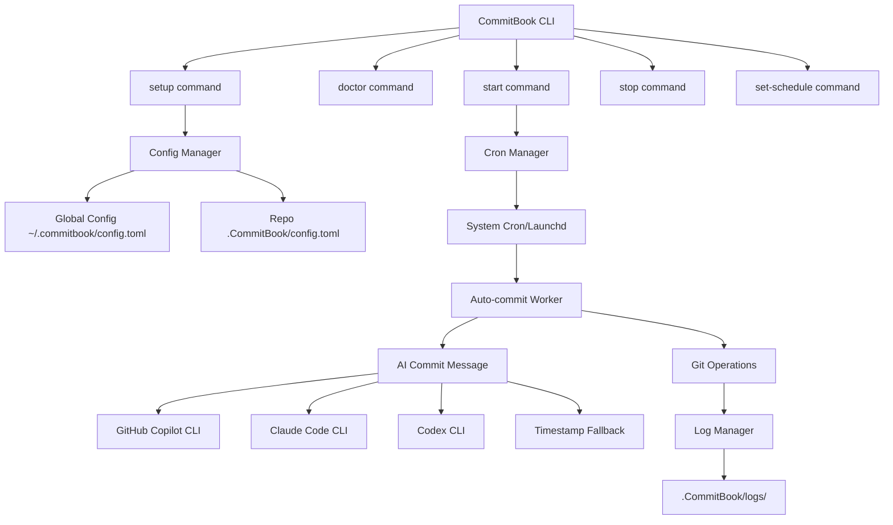

# CommitBook Implementation Plan

## Architecture Overview

CommitBook will be built as a Rust CLI application with the following architecture:



## Project Structure

```
commitbook/
├── Cargo.toml                  # Rust package manifest
├── README.md                   # Documentation
├── LICENSE                     # MIT License (already exists)
├── src/
│   ├── main.rs                 # CLI entry point
│   ├── commands/               # Command implementations
│   │   ├── mod.rs
│   │   ├── setup.rs            # Setup command
│   │   ├── doctor.rs           # Health check command
│   │   ├── start.rs            # Start auto-commits
│   │   ├── stop.rs             # Stop auto-commits
│   │   └── schedule.rs         # Modify schedule
│   ├── config/                 # Configuration management
│   │   ├── mod.rs
│   │   ├── global.rs           # Global config (~/.commitbook/)
│   │   └── local.rs            # Repo config (.CommitBook/)
│   ├── cron/                   # Cron integration
│   │   ├── mod.rs
│   │   ├── macos.rs            # Launchd integration
│   │   ├── linux.rs            # Crontab integration
│   │   └── windows.rs          # Task Scheduler (future)
│   ├── git/                    # Git operations
│   │   ├── mod.rs
│   │   ├── operations.rs       # Commit, push, status
│   │   └── remote.rs           # Remote validation
│   ├── ai/                     # AI commit message generation
│   │   ├── mod.rs
│   │   ├── copilot.rs          # GitHub Copilot CLI
│   │   ├── claude.rs           # Claude Code CLI (future)
│   │   ├── codex.rs            # Codex CLI (future)
│   │   └── fallback.rs         # Timestamp fallback
│   ├── logger/                 # Logging system
│   │   ├── mod.rs
│   │   └── file_logger.rs      # Write to .CommitBook/logs/
│   └── utils/                  # Utilities
│       ├── mod.rs
│       └── datetime.rs         # Time formatting
├── tests/                      # Integration tests
│   ├── test_setup.rs
│   ├── test_doctor.rs
│   └── test_auto_commit.rs
└── install.sh                  # Installation script
```

## Key Rust Dependencies (Cargo.toml)

```toml
[dependencies]
clap = { version = "4.5", features = ["derive"] }  # CLI framework
tokio = { version = "1", features = ["full"] }      # Async runtime
anyhow = "1.0"                                      # Error handling
serde = { version = "1.0", features = ["derive"] }  # Serialization
toml = "0.8"                                        # Config format
git2 = "0.19"                                       # Git operations
chrono = { version = "0.4", features = ["serde"] }  # Date/time
dirs = "5.0"                                        # Home directory
colored = "2.1"                                     # Terminal colors
log = "0.4"                                         # Logging facade
env_logger = "0.11"                                 # Logger implementation
which = "7"                                         # Find executables
sha2 = "0.10"                                       # Hashing (plist labels)
hex = "0.4"                                         # Hex encoding
fs2 = "0.4"                                         # File locking
```

## Configuration Schema

### Global Config (~/.commitbook/config.toml)

```toml
version = "1.0.0"

[repos]
# Map of repo paths to their settings
"/Users/user/notes" = { enabled = true, schedule = "hourly" }
"/Users/user/journal" = { enabled = true, schedule = "daily" }

[ai]
# Priority order for commit message generation
providers = ["gh-copilot", "claude-cli", "codex-cli", "fallback"]
gh_copilot_path = "/opt/homebrew/bin/gh"
```

### Local Repo Config (.CommitBook/config.toml)

```toml
enabled = true
schedule = "0 * * * *"  # Cron expression (hourly)
last_commit = "2026-02-15T14:30:00Z"
created_at = "2026-02-15T10:00:00Z"

[git]
auto_push = true
branch = "main"

[logging]
level = "info"
max_log_files = 30  # Keep 30 days of logs
```

## Implementation Phases

### Phase 1: Core CLI Structure

**Files:** `src/main.rs`, `Cargo.toml`

Set up the basic CLI using clap with subcommands:

- Define `CommitBookCli` struct with derive macros
- Implement subcommand routing
- Add global flags: `--verbose`, `--quiet`, `--repo <path>`
- Set up error handling with anyhow

### Phase 2: Configuration Management

**Files:** `src/config/mod.rs`, `src/config/global.rs`, `src/config/local.rs`

Implement config system:

- Create config structs with serde derives
- Global config at `~/.commitbook/config.toml`
- Local repo config at `<repo>/.CommitBook/config.toml`
- Config validation and migration
- Multi-repo registry in global config

### Phase 3: Git Operations Module

**Files:** `src/git/mod.rs`, `src/git/operations.rs`, `src/git/remote.rs`

Build git integration using git2-rs:

- Check if directory is a git repo
- Get current status (staged, unstaged, untracked)
- Stage all changes
- Create commits with custom messages
- Push to remote with error handling
- Validate remote connectivity

### Phase 4: Setup Command

**Files:** `src/commands/setup.rs`

Implement `commitbook setup` command:

1. Verify current directory is a git repo
2. Check for git remote
3. Create `.CommitBook/` directory
4. Create initial `config.toml` with defaults
5. Create `logs/` subdirectory
6. Add `.CommitBook/logs/` and `.CommitBook/.lock` to `.gitignore`
7. Register repo in global config
8. Interactive prompts for schedule preference

### Phase 5: Doctor Command

**Files:** `src/commands/doctor.rs`

Implement `commitbook doctor` command with health checks:

- Git installation check (`git --version`)
- Git remote connectivity (`git ls-remote`)
- GitHub CLI installation (`which gh`)
- GitHub Copilot CLI availability (`gh copilot --version`)
- Authentication status (`gh auth status`)
- Repo configuration validation
- Cron/launchd accessibility
- Write permissions for logs
- Display report with colored output

### Phase 6: AI Commit Message Generation

**Files:** `src/ai/mod.rs`, `src/ai/copilot.rs`, `src/ai/fallback.rs`

Implement commit message generation:

- Call `gh copilot suggest "Generate a commit message for: <diff summary>"`
- Parse copilot output and extract message
- Implement fallback: timestamp-based message format
- Future: Claude Code CLI and Codex CLI integration
- Retry logic with provider fallback chain

### Phase 7: Cron Integration (macOS/Linux)

**Files:** `src/cron/mod.rs`, `src/cron/macos.rs`, `src/cron/linux.rs`

Platform-specific cron management:

**macOS (launchd):**

- Create plist file at `~/Library/LaunchAgents/com.commitbook.<hash>.plist`
- Template with `StartInterval` or `StartCalendarInterval`
- Commands: `launchctl load/unload`
- Store plist path in repo config

**Linux (cron):**

- Add entry to user crontab
- Format: `0 * * * * /path/to/commitbook auto-commit --repo /path/to/repo`
- Use `crontab -l` and `crontab -` for management
- Comment entries with `# CommitBook: <repo-path>`

### Phase 8: Start Command

**Files:** `src/commands/start.rs`

Implement `commitbook start` command:

1. Validate repo is set up (`.CommitBook/` exists)
2. Read schedule from local config
3. Create cron/launchd entry
4. Update config with `enabled = true`
5. Test run a single commit cycle
6. Confirm activation with user

### Phase 9: Stop Command

**Files:** `src/commands/stop.rs`

Implement `commitbook stop` command:

1. Find cron/launchd entry for this repo
2. Remove/disable entry
3. Update config with `enabled = false`
4. Preserve logs and config
5. Confirm deactivation

### Phase 10: Set Schedule Command

**Files:** `src/commands/schedule.rs`

Implement `commitbook set-schedule <expression>` command:

- Parse cron expression
- Validate syntax
- Update local config
- If running, update cron/launchd entry
- Presets: `hourly`, `daily`, `every-4h`, or custom cron

### Phase 11: Auto-Commit Worker

**Files:** `src/commands/auto_commit.rs` (hidden command)

Create the background worker invoked by cron:

1. Acquire file lock at `.CommitBook/.lock` (prevent concurrent runs)
2. Read repo config
3. Check git status for changes
4. If changes exist:
  - Get git diff summary
  - Generate commit message via AI
  - Stage all changes
  - Commit with generated message
  - Push to remote
5. Log all operations
6. Handle errors gracefully (no crashes)
7. Release lock and remove lock file

### Phase 12: Logging System

**Files:** `src/logger/mod.rs`, `src/logger/file_logger.rs`

Implement structured logging:

- Log file naming: `YYYY-MM-DD.log` in `.CommitBook/logs/`
- Format: `[TIMESTAMP] [LEVEL] message`
- Rotation: one file per day
- Cleanup: remove logs older than 30 days
- Levels: ERROR, WARN, INFO, DEBUG
- Stdout for CLI commands, file for auto-commit

### Phase 13: Testing Suite

**Files:** `tests/*`

Write comprehensive tests:

- Unit tests for config parsing
- Integration tests with temporary git repos
- Mock git operations
- Cron expression validation tests
- Error handling scenarios
- AI provider fallback chain

### Phase 14: Documentation & Distribution

**Files:** `README.md`, `install.sh`

Create user documentation:

- Installation instructions (cargo install, homebrew, binary)
- Quick start guide
- Command reference
- Configuration examples
- Troubleshooting guide
- Build installation script with platform detection

## Command Examples

```bash
# Initialize a repo for auto-commits
commitbook setup

# Check system health
commitbook doctor

# Start auto-commits (uses configured schedule)
commitbook start

# Stop auto-commits
commitbook stop

# Change schedule
commitbook set-schedule hourly
commitbook set-schedule "*/30 * * * *"  # Every 30 minutes

# Manual commit (for testing)
commitbook commit --dry-run
```

## Security Considerations

1. **Credentials**: Never store git credentials; rely on system git config
2. **File Permissions**: Restrict `.CommitBook/` to user-only (chmod 700)
3. **Lock Files**: Prevent race conditions in concurrent executions
4. **Input Validation**: Sanitize all user inputs and cron expressions
5. **Log Sanitization**: Don't log sensitive diff content

## Error Handling Strategy

- **Network failures**: Log and skip, retry next cycle
- **Merge conflicts**: Log error, halt auto-commits, require manual resolution
- **AI provider failures**: Cascade through fallback chain
- **Permission errors**: Log and alert user via system notification
- **Config corruption**: Fall back to defaults and warn user

## Performance Targets

- CLI startup: < 100ms (Rust binary)
- Auto-commit cycle: < 5s for typical repo
- Binary size: < 5MB (release build with strip)
- Memory usage: < 20MB during operation

## Performance Results (Actual)

- Binary size: 1.9MB (release build, strip + LTO + opt-level=z)
- Tests: 17 passing (6 unit + 11 integration)

## Future Enhancements (Post-MVP)

- Windows Task Scheduler support
- Desktop notifications for errors
- Web dashboard for multi-repo monitoring
- Selective file commits via patterns
- Commit message templates
- Integration with Claude Code CLI and Codex CLI
- GitHub App for server-side commits
